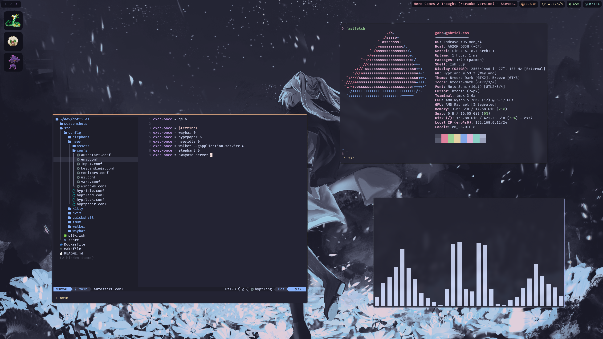

# My dotfiles

Feel free to copy them, just keep in mind it won't just work out of the box.

## Dependencies

* FiraCode Nerd Font
* Neovim + Lazy.nvim
* Kitty
* zsh + oh-my-zsh + powerlevel10k
* Tmux + tpm
* Hyprland, Hyprlock, Hypridle, Hyprpaper
* Waybar
* Walker + Elephant
* Quickshell
* Grim, slurp, wl-clipboard

## Screenshots

